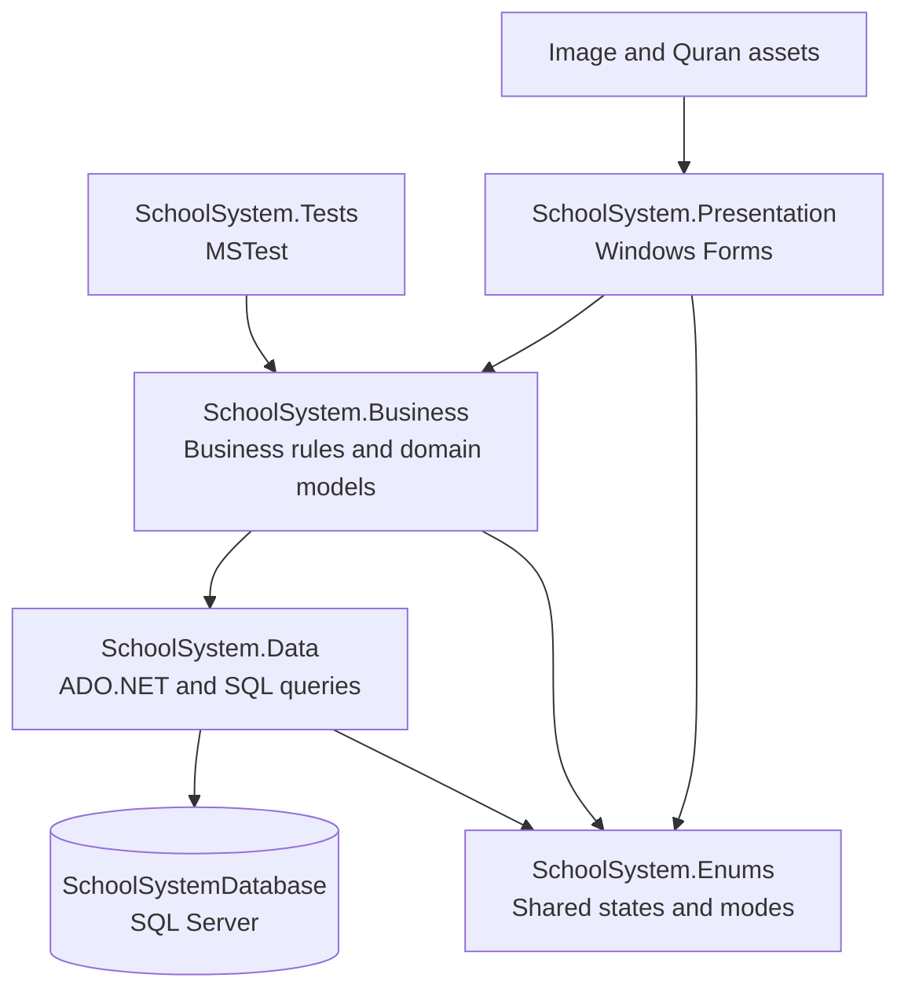
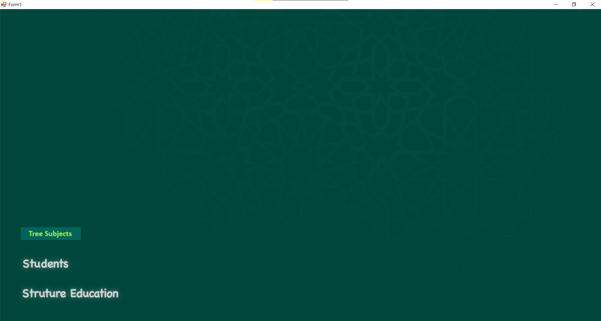
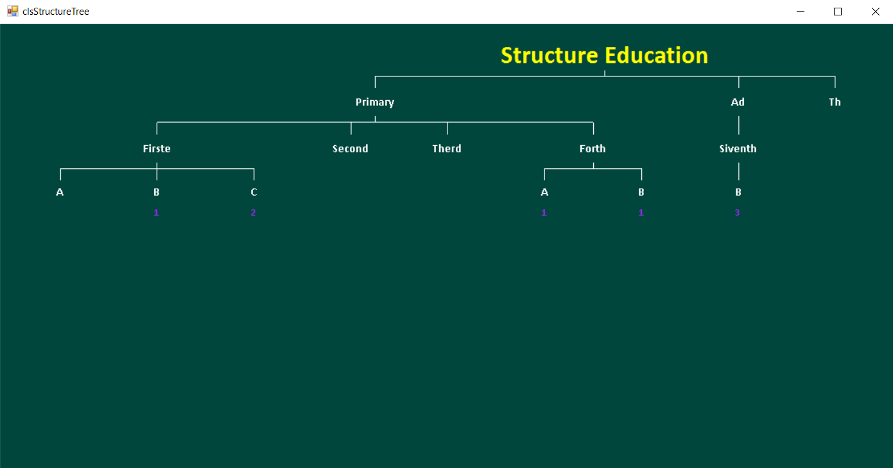
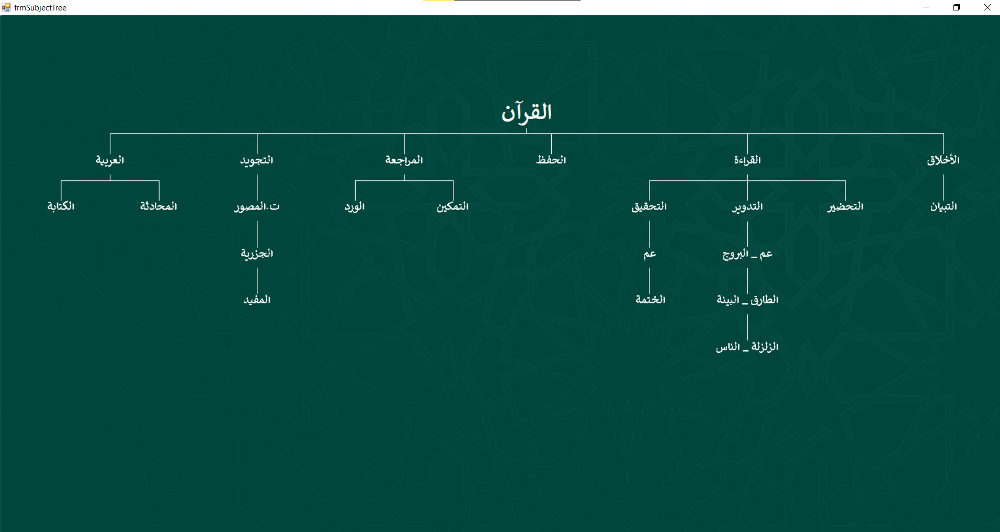
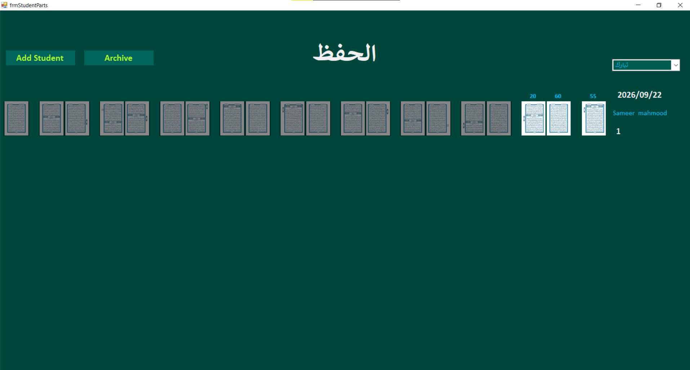

# School System — Portfolio Case Study

> A layered Windows desktop application for managing a school’s people, academic structure, subjects, and Quran learning progress.

## Project snapshot

| Area | Details |
| --- | --- |
| Platform | Windows Forms on .NET Framework 4.8 |
| Language | C# |
| Database | Microsoft SQL Server with ADO.NET |
| Architecture | Presentation, Business, Data, Enums, and Tests |
| Current scale | 123 production C# files and approximately 20,000 lines |
| User interface | 22 forms and 8 reusable user controls |
| Database schema | 16 application tables |
| Automated quality | 9 passing MSTest unit tests |
| Quran assets | 604 page images with database synchronization |

## The problem

School administration data often becomes fragmented across unrelated files and manual workflows. This project brings the main operational areas into one desktop system while keeping the code divided into clear layers.

The application manages:

- people, students, and teachers;
- stages, grades, sections, and their hierarchy;
- subjects and student-subject assignments;
- Quran tracks, parts, pages, revision, and student progress;
- recitation errors and archived progress records.

## Architecture

The presentation layer does not contain connection strings or direct database access. Business objects coordinate application behavior, while the data layer owns SQL operations and reads its connection string from application configuration.

## Engineering highlights

### Layered legacy application cleanup

The solution was reorganized into explicit projects and domain folders without rewriting the working application. Namespaces now mirror the project structure, and generated files, experiments, dead code, and machine-specific paths were removed.

### Reproducible database setup

`Database/Scripts/001_CreateSchema.sql` recreates the 16-table schema, including keys, relationships, defaults, indexes, constraints, and the subject-assignment trigger. No credentials or personal records are stored in the repository.

### Portable asset handling

Navigation images are copied next to the executable during a build. Quran images remain outside the build output because of their size; the application resolves a saved folder, a deployed folder, a development folder, or asks the user to select one. Synchronization updates database paths after moving to another computer.

### Automated tests without database side effects

The MSTest project validates tree-node construction, hierarchy behavior, and Quran page-number parsing. The test suite does not connect to SQL Server and currently passes 9 of 9 tests.

## Technical decisions

- Kept the application on .NET Framework 4.8 to preserve compatibility with the existing Windows Forms codebase.
- Used parameterized ADO.NET commands rather than introducing an ORM during project stabilization.
- Kept UI prefixes such as `frm`, `ctr`, `btn`, and `lbl` because they communicate the role of Windows Forms components.
- Moved the connection string to `App.config` and used Windows Authentication by default.
- Avoided exporting student, teacher, or person records with the database setup script.
- Added a small, independent unit-test boundary before considering database integration tests.

## Quality evidence

- The complete five-project solution builds successfully with Visual Studio 2022 MSBuild.
- The test runner discovers and passes all 9 unit tests.
- Source files contain no developer-specific absolute paths.
- Visual Studio and build artifacts are excluded through `.gitignore`.
- Setup, database, asset, and test instructions are documented in `README.md`.

## Screenshots

Real screenshots should use demo data only. The capture checklist and recommended filenames are in [`docs/screenshots/README.md`](docs/screenshots/README.md). This avoids publishing names, contact details, or progress belonging to real students.

### Main navigation dashboard

### Academic structure tree

### Subject hierarchy

### Quran progress

## Run the project

1. Install Visual Studio 2022 with **.NET desktop development** and the .NET Framework 4.8 Developer Pack.
2. Run `Database/Scripts/001_CreateSchema.sql` in SQL Server Management Studio.
3. Configure `SchoolSystem.Presentation/App.config`.
4. Open `SchoolSystem.Presentation/SchoolSystem.sln`.
5. Build the solution and run `SchoolSystem.Presentation`.

For complete setup and test commands, see [`README.md`](README.md).

## Resume-ready summary

**Short description**

Built and stabilized a layered C# Windows Forms school-management system backed by SQL Server, covering academic structure, student and teacher records, subject assignments, and Quran progress tracking.

**Suggested resume bullets**

- Developed a five-project C#/.NET Framework solution using Presentation, Business, Data Access, shared Enums, and automated Test layers.
- Designed and documented a reproducible 16-table SQL Server schema with relationships, constraints, indexes, and safe configuration handling.
- Implemented Quran learning workflows across 604 page assets, including tracks, parts, repetition status, recitation errors, and student progress.
- Improved portability by removing machine-specific paths and introducing configurable asset discovery and synchronization.
- Added an MSTest suite with 9 database-independent tests and established a clean, warning-free build.

## Next engineering steps

- Add integration tests against a disposable database.
- Introduce structured application logging instead of silent exception handling.
- Add demo seed data that contains no personal information.
- Package the desktop application for repeatable installation.
